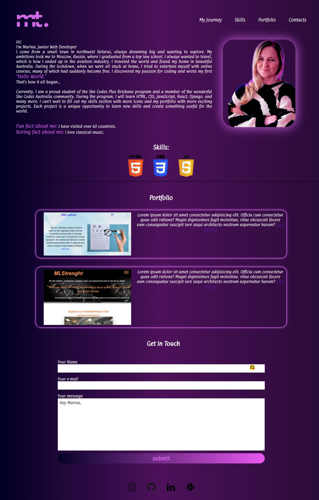

#  your_name_here - Portfolio Task
​
[My portfolio site](marina-terina.github.io)
​
## Project Requirements

### Content
 For my portfolio project, I included a profile picture and a detailed biography to provide a personal connection and background information. I added a functional contact form for easy communication and a "Projects" section to showcase my skills. Additionally, I included links to my GitHub and LinkedIn profiles. I aimed for a clean, modern design with a cohesive color scheme and intuitive layout, focusing on responsive design and optimized performance for a seamless user experience.
- [x] At least one profile picture
- [x] Biography (at least 100 words)
- [x] Functional Contact Form
- [x] "Projects" section
- [x] Links to external sites, e.g. GitHub and LinkedIn.
​
### Technical
 I included five pages, though currently, only 2 are functional while 3 are still in progress. I used Git for version control to manage updates and track changes. The site is deployed on GitHub Pages for easy access and sharing. Responsive design principles were implemented to ensure compatibility across various devices, and semantic HTML was used to improve accessibility and SEO.
- [x] At least 2 web pages.
- [x] Version controlled with Git
- [x] Deployed on GitHub pages.
- [x] Implements responsive design principles.
- [x] Uses semantic HTML.

### Bonus (optional)
 I utilized CSS for hover effects, gradients, and keyframe animations to create a visually engaging design. Additionally, I used JavaScript specifically to implement a mobile menu, improving navigation on smaller screens. 
- [x] Different styles for active, hover and focus states.
- [x] Include JavaScript to add some dynamic elements to your site. (Extra tricky!)
​
### Screenshots
> Please include the following:
> - The different pages and features of your website on mobile, tablet and desktop screen sizes (multiple screenshots per page and screen size).
> - The different features of your site, e.g. if you have hover states, take a screenshot that shows that.  
> 
> You can do this by saving the images in a folder in your repo, and including them in your readme document with the following Markdown code: 

####  image_title_goes_here 

